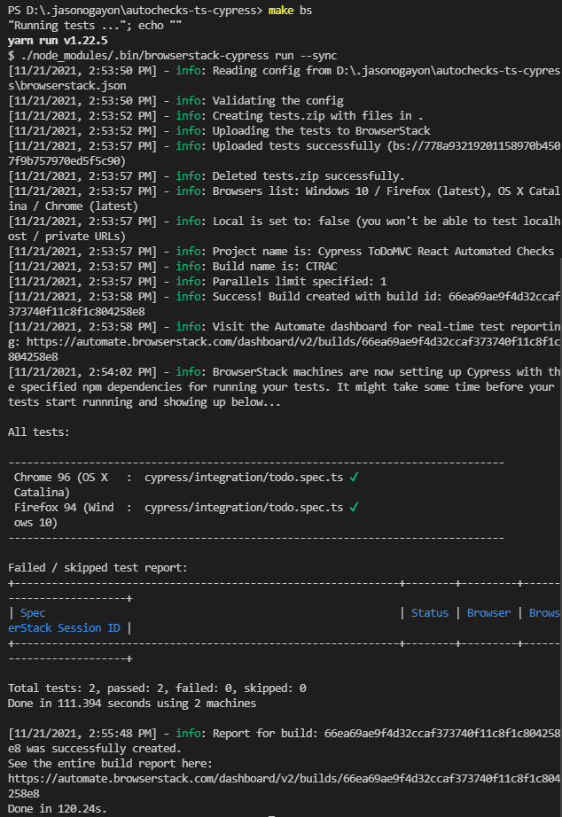

# ToDoMVC React Automated Checks using Typescript and Cypress 

## Running Cypress UI Tests

https://user-images.githubusercontent.com/8307613/140059947-d2ea7301-5c2b-40c0-874a-a0eed52421f0.mp4

---

### Headlessly

1. Open a web browser. Go to the remote code repository (<https://github.com/jasonogayon/autochecks-ts-cypress>) and copy its SSH or HTTPS link.

2. On your machine, open a terminal and clone the remote repository locally wherever you want. Run `git clone git@github.com:jasonogayon/autochecks-ts-cypress.git`.

3. After that, go inside the cloned **autochecks-ts-cypress** repository. You can decide to rename this directory to what you want.

4. Now we can try to run our Cypress tests locally on our machine. They will of course fail first because we have not yet installed our code dependencies. Run `npm run test` or `make h`.

5. So install the dependencies. Run `npm install`.

6. After that, we can try to run our tests again and see if they proceed. Run `npm run test` or `make h` again.

---

### Via the Cypress UI

1. Follow the same steps 1-5 above.

2. Open the Cypress UI by running `npm run cy` or `make s`

3. Run the tests

---

### Via Browserstack

1. Follow the same steps 1-3 above.

2. Create a Browserstack account, and get your Automate user name and access key when you're signed in.

3. Update the `browserstack.json` file with your Browserstack user name and access key.

4. Run the tests by running `npm run bs` or `make bs`

---

### Reports

Running the Cypress UI tests headlessly generates a test report in HTML format, found inside the **cypress/report** directory.

There will also be a `.mp4` recording of the rest run, saved in the **cypress/videos** directory.

Below are screenshots of a sample Browserstack test run:

---

Author: Jason B. Ogayon \
Software Engineer and Software Tester
